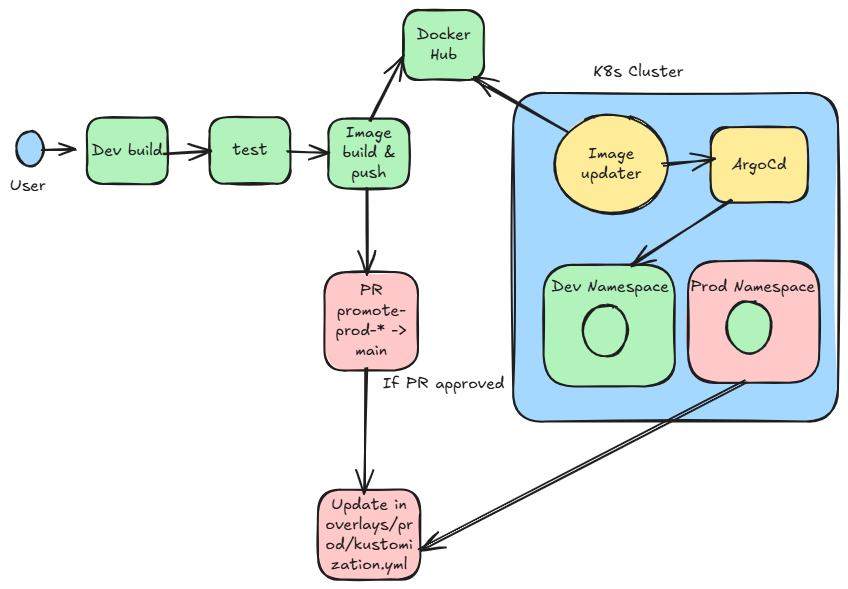

End-to-End Guestbook App deployment



# Create EKS cluster


## Prequisite Install terraform 

1. Download terraform based on the OS

```
https://developer.hashicorp.com/terraform/install
```
2. unzip the downloaded terraform package

```
unzip terraform_1.13.3_darwin_arm64
```
3. move the Terraform binary to /usr/local/bin/:

```
sudo mv terraform /usr/local/bin/
```
4. verify terraform is installed
```
terraform -version
```

## EKS Cluster Creation

1. create a file with below code

```


# Configure the AWS provider
provider "aws" {
  region = "us-east-1"
}

# Data source to fetch the default VPC
data "aws_vpc" "default" {
  default = true
}

# Data source to fetch subnets in specific availability zones (us-east-1a and us-east-1b)
data "aws_subnets" "default" {
  filter {
    name   = "vpc-id"
    values = [data.aws_vpc.default.id]
  }

  filter {
    name   = "availability-zone"
    values = ["us-east-1a", "us-east-1b"]
  }
}

# Create IAM role for EKS cluster
resource "aws_iam_role" "eks_cluster_role" {
  name = "eks-cluster-role"

  assume_role_policy = jsonencode({
    Version = "2012-10-17"
    Statement = [
      {
        Action = "sts:AssumeRole"
        Effect = "Allow"
        Principal = {
          Service = "eks.amazonaws.com"
        }
      }
    ]
  })
}

# Attach the AmazonEKSClusterPolicy to the EKS cluster role
resource "aws_iam_role_policy_attachment" "eks_cluster_policy" {
  policy_arn = "arn:aws:iam::aws:policy/AmazonEKSClusterPolicy"
  role       = aws_iam_role.eks_cluster_role.name
}

# Create the EKS cluster
resource "aws_eks_cluster" "example" {
  name     = "argocd-cluster"
  role_arn = aws_iam_role.eks_cluster_role.arn

  vpc_config {
    subnet_ids = data.aws_subnets.default.ids
  }

  # Ensure that IAM role permissions are created before and deleted after EKS cluster handling
  depends_on = [
    aws_iam_role_policy_attachment.eks_cluster_policy
  ]
}

# Create IAM role for EKS node group
resource "aws_iam_role" "eks_node_group_role" {
  name = "eks-node-group-role"

  assume_role_policy = jsonencode({
    Version = "2012-10-17"
    Statement = [
      {
        Action = "sts:AssumeRole"
        Effect = "Allow"
        Principal = {
          Service = "ec2.amazonaws.com"
        }
      }
    ]
  })
}

# Attach policies to the node group role
resource "aws_iam_role_policy_attachment" "eks_worker_node_policy" {
  policy_arn = "arn:aws:iam::aws:policy/AmazonEKSWorkerNodePolicy"
  role       = aws_iam_role.eks_node_group_role.name
}

resource "aws_iam_role_policy_attachment" "eks_cni_policy" {
  policy_arn = "arn:aws:iam::aws:policy/AmazonEKS_CNI_Policy"
  role       = aws_iam_role.eks_node_group_role.name
}

resource "aws_iam_role_policy_attachment" "ec2_container_registry_readonly" {
  policy_arn = "arn:aws:iam::aws:policy/AmazonEC2ContainerRegistryReadOnly"
  role       = aws_iam_role.eks_node_group_role.name
}

# Create EKS node group
resource "aws_eks_node_group" "example" {
  cluster_name    = aws_eks_cluster.example.name
  node_group_name = "example-node-group"
  node_role_arn   = aws_iam_role.eks_node_group_role.arn
  subnet_ids      = data.aws_subnets.default.ids

  scaling_config {
    desired_size = 2
    max_size     = 3
    min_size     = 1
  }

  instance_types = ["t3.medium"]

  depends_on = [
    aws_iam_role_policy_attachment.eks_worker_node_policy,
    aws_iam_role_policy_attachment.eks_cni_policy,
    aws_iam_role_policy_attachment.ec2_container_registry_readonly
  ]
}

# Output the EKS cluster endpoint
output "cluster_endpoint" {
  value = aws_eks_cluster.example.endpoint
}

# Output the cluster name
output "cluster_name" {
  value = aws_eks_cluster.example.name
}
```
2. Initiaize terraform

```
terraform init
```
3. Apply the changes

```
terraform apply -auto-approve
```
4. verify if EKS cluster is created
```
aws eks update-kubeconfig --region us-east-1 --name argocd-cluster
kubectl get nodes -A
```


# Install ArgoCd and Argo-Rollout
Follow argocd-installation.md and argorollout-installation.md to install argocd and argorollouts controllers


Install ArgoCD
```
kubectl create namespace argocd
kubectl apply -n argocd -f https://raw.githubusercontent.com/argoproj/argo-cd/stable/manifests/install.yaml
kubectl port-forward svc/argocd-server -n argocd 8080:443
kubectl get secret argocd-initial-admin-secret -n argocd -o jsonpath="{.data.password}" | base64 -d; echo
```

```
windows:
kubectl get secret argocd-initial-admin-secret -n argocd -o jsonpath="{.data.password}" |
ForEach-Object { [System.Text.Encoding]::UTF8.GetString([System.Convert]::FromBase64String($_)) }
```

Install ArgoRollouts
```
kubectl create namespace argo-rollouts
kubectl apply -n argo-rollouts -f https://github.com/argoproj/argo-rollouts/releases/latest/download/install.yaml
```

Install ingress controllers
```
kubectl apply -f https://raw.githubusercontent.com/kubernetes/ingress-nginx/controller-v1.10.0/deploy/static/provider/aws/deploy.yaml
```


Install image updater 
```
kubectl apply -n argocd -f https://raw.githubusercontent.com/argoproj-labs/argocd-image-updater/v0.12.2/manifests/install.yaml
kubectl get pods -n argocd

kubectl create secret generic github-repo-creds -n argocd --from-literal=url=https://github.com/crazylearning-cr/guestbook.git --from-literal=username=git --from-literal=password=github_pat_xxxxxxxx --from-literal=type=git --dry-run=client -o yaml | kubectl apply -f -

kubectl label secret github-repo-creds -n argocd argocd.argoproj.io/secret-type=repo-creds

kubectl rollout restart deployment argocd-repo-server -n argocd

kubectl logs -n argocd deployment/argocd-image-updater -f
```

# Guestbook App repo
Fork guestbook repo [https://github.com/crazylearning-cr/guestbook.git] in your github account
This contains the guestbook app under app folder and k8s-manifest

```
app --> Guestbook Application source code
k8s-manifests --> Deployment manifests files
.github/workflows --> Github Actions workflow orchestration config file
```

# Add secrets for Github actions
Add below secrets in your repository >> settings >> secrets and variables >> actions >> Add secrets under "Repository secrets" by clicking on "New repository secret"

```
DOCKERHUB_USERNAME
DOCKERHUB_PASSWORD
```

# Add the below files in your github repo

.github/workflows/ci.yaml
```name: Guestbook CI – Build & Propose Prod Promotion

permissions:
  contents: write
  pull-requests: write

on:
  push:
    branches:
      - main
    paths-ignore:
      - 'k8s-manifests/**'

jobs:
  build-and-propose:
    runs-on: ubuntu-latest

    env:
      IMAGE_NAME: ${{ secrets.DOCKERHUB_USERNAME }}/guestbook
      DOCKERHUB_USERNAME: ${{ secrets.DOCKERHUB_USERNAME }}
      DOCKERHUB_PASSWORD: ${{ secrets.DOCKERHUB_PASSWORD }}
      COMMIT_EMAIL: github-actions@example.com
      COMMIT_NAME: GitHub Actions Bot

    steps:
    - name: Checkout repo
      uses: actions/checkout@v4
      with:
        fetch-depth: 0

    # ----------------------------
    # Build & Push Image
    # ----------------------------
    - name: Docker login
      run: |
        echo "${DOCKERHUB_PASSWORD}" | docker login -u "${DOCKERHUB_USERNAME}" --password-stdin

    - name: Build & push image
      run: |
        IMAGE_TAG=$(git rev-parse --short HEAD)
        echo "IMAGE_TAG=${IMAGE_TAG}" >> $GITHUB_ENV

        docker build -t ${IMAGE_NAME}:${IMAGE_TAG} ./app
        docker push ${IMAGE_NAME}:${IMAGE_TAG}

    # ----------------------------
    # Prepare PROD promotion branch
    # ----------------------------
    - name: Install kustomize
      run: |
        curl -s https://raw.githubusercontent.com/kubernetes-sigs/kustomize/master/hack/install_kustomize.sh | bash
        sudo mv kustomize /usr/local/bin/

    - name: Update prod manifest
      run: |
        cd k8s-manifests/guestbook-rollout/overlays/prod
        kustomize edit set image \
          udemykcloud534/guestbook=${IMAGE_NAME}:${IMAGE_TAG}

    - name: Create Pull Request
      uses: peter-evans/create-pull-request@v6
      with:
        token: ${{ secrets.GITHUB_TOKEN }}
        commit-message: "prod: promote guestbook to ${IMAGE_TAG}"
        branch: promote-prod-${{ env.IMAGE_TAG }}
        base: main
        title: "Promote guestbook to PROD (${IMAGE_TAG})"
        body: |
          Image: ${IMAGE_NAME}:${IMAGE_TAG}
```

k8s-manifests\guestbook-rollout\base\kustomization.yaml
```
resources:
  - rollout.yaml
```

k8s-manifests\guestbook-rollout\base\rollout.yaml
```
apiVersion: argoproj.io/v1alpha1
kind: Rollout
metadata:
  name: guestbook-ui
spec:
  replicas: 3
  revisionHistoryLimit: 2
  selector:
    matchLabels:
      app: guestbook-ui
  template:
    metadata:
      labels:
        app: guestbook-ui
    spec:
      containers:
        - name: guestbook-ui
          image: udemykcloud534/guestbook:yellow
          ports:
            - containerPort: 8080
          readinessProbe:
            httpGet:
              path: /
              port: 8080
            initialDelaySeconds: 5
            periodSeconds: 10
          livenessProbe:
            httpGet:
              path: /
              port: 8080
            initialDelaySeconds: 10
            periodSeconds: 20
          resources:
            requests:
              cpu: "100m"
              memory: "128Mi"
            limits:
              cpu: "500m"
              memory: "256Mi"
  strategy:
    canary:
      steps:
        # 1) Start some canary pods, but DON'T send prod traffic yet
        - setCanaryScale:
            replicas: 1

        # 2) Pause so testers can hit /preview (canary only)
        - pause: {}

        # 3) Now start shifting prod traffic
        - setWeight: 20
        - pause: {}

        - setWeight: 50
        - pause: {}

        - setWeight: 100
      canaryService: guestbook-ui-canary
      stableService: guestbook-ui
      trafficRouting:
        nginx:
          stableIngress: guestbook-ui-ingress
---
apiVersion: v1
kind: Service
metadata:
  name: guestbook-ui
spec:
  ports:
    - port: 80
      targetPort: 8080
  selector:
    app: guestbook-ui
---
apiVersion: v1
kind: Service
metadata:
  name: guestbook-ui-canary
spec:
  ports:
    - port: 80
      targetPort: 8080
  selector:
    app: guestbook-ui
---
# Main ingress used by Argo Rollouts for weighted traffic
apiVersion: networking.k8s.io/v1
kind: Ingress
metadata:
  name: guestbook-ui-ingress
  annotations:
    nginx.ingress.kubernetes.io/canary: "false"
    kubernetes.io/ingress.class: "nginx"
spec:
  ingressClassName: nginx
  rules:
    - http:
        paths:
          - path: /
            pathType: Prefix
            backend:
              service:
                name: guestbook-ui
                port:
                  number: 80
```

k8s-manifests\guestbook-rollout\overlays\dev\kustomization.yaml
```
resources:
- ../../base

nameSuffix: -dev

patches:
  - target:
      kind: Rollout
      name: guestbook-ui
    patch: |-
      - op: replace
        path: /spec/replicas
        value: 1

      - op: replace
        path: /spec/strategy/canary/stableService
        value: guestbook-ui-dev

      - op: replace
        path: /spec/strategy/canary/canaryService
        value: guestbook-ui-canary-dev

      - op: replace
        path: /spec/strategy/canary/trafficRouting/nginx/stableIngress
        value: guestbook-ui-ingress-dev

images:
- name: udemykcloud534/guestbook
  newTag: e8ed4d8
apiVersion: kustomize.config.k8s.io/v1beta1
kind: Kustomization
```

k8s-manifests\guestbook-rollout\overlays\prod\kustomization.yaml
```
resources:
- ../../base

nameSuffix: -prod

patches:
  - target:
      kind: Rollout
      name: guestbook-ui
    patch: |-
      - op: replace
        path: /spec/replicas
        value: 2

      - op: replace
        path: /spec/strategy/canary/stableService
        value: guestbook-ui-prod

      - op: replace
        path: /spec/strategy/canary/canaryService
        value: guestbook-ui-canary-prod

      - op: replace
        path: /spec/strategy/canary/trafficRouting/nginx/stableIngress
        value: guestbook-ui-ingress-prod
images:
- name: udemykcloud534/guestbook
  newName: udemykcloud534/guestbook
  newTag: 091c31e
apiVersion: kustomize.config.k8s.io/v1beta1
kind: Kustomization
```

# Create ArgoApplications

```
apiVersion: argoproj.io/v1alpha1
kind: AppProject
metadata:
  name: guestbook
  namespace: argocd
spec:
  description: Guestbook project (single-cluster)

  sourceRepos:
    - https://github.com/crazylearning-cr/guestbook.git

  destinations:
    - namespace: '*'
      server: https://kubernetes.default.svc

  # Allow namespace creation
  clusterResourceWhitelist:
    - group: ""
      kind: Namespace

  # Allow all namespaced resources (Deployments, Rollouts, Services, Ingress, etc.)
  namespaceResourceWhitelist:
    - group: "*"
      kind: "*"

```

```
apiVersion: argoproj.io/v1alpha1
kind: Application
metadata:
  name: guestbook-dev
  namespace: argocd
  annotations:
    argocd-image-updater.argoproj.io/image-list: guestbook=udemykcloud534/guestbook
    argocd-image-updater.argoproj.io/guestbook.update-strategy: latest
    argocd-image-updater.argoproj.io/guestbook.allow-tags: regexp:^[a-f0-9]{7}$
    argocd-image-updater.argoproj.io/guestbook.tag-order: lexicographical
    argocd-image-updater.argoproj.io/write-back-method: git
    argocd-image-updater.argoproj.io/write-back-target: kustomization
    argocd.argoproj.io/secret-type: repo-creds
spec:
  project: guestbook
  source:
    repoURL: https://github.com/crazylearning-cr/guestbook.git
    targetRevision: main
    path: k8s-manifests/guestbook-rollout/overlays/dev
  destination:
    server: https://kubernetes.default.svc
    namespace: dev
  syncPolicy:
    automated:
      prune: true
      selfHeal: true
    syncOptions:
      - CreateNamespace=true

---
apiVersion: argoproj.io/v1alpha1
kind: Application
metadata:
  name: guestbook-prod
  namespace: argocd
spec:
  project: guestbook
  source:
    repoURL: https://github.com/crazylearning-cr/guestbook.git
    targetRevision: main
    path: k8s-manifests/guestbook-rollout/overlays/prod
  destination:
    server: https://kubernetes.default.svc
    namespace: prod
  syncPolicy:
    automated:
      prune: true
      selfHeal: true
    syncOptions:
      - CreateNamespace=true
```

```
kubectl apply -f k8s-manifests/argo-application/project.yaml
kubectl apply -f k8s-manifests/argo-application/application.yaml
```


Promote to next level
```
kubectl argo rollouts promote guestbook-ui -n dev


GitHub repo
 → Settings
 → Actions
 → General
 sllow creating pr


C:\Windows\System32\drivers\etc\hosts

a9a36977b34b249dbb2578d94e69a288.elb.us-east-1.amazonaws.com guestbook-dev.local
a9a36977b34b249dbb2578d94e69a288.elb.us-east-1.amazonaws.com
ipconfig /flushdns

 Invoke-WebRequest `
>>   -Uri http://a9a36977b34b249dbb2578d94e69a288-77c0f8d383910bc2.elb.us-east-1.amazonaws.com `
>>   -Headers @{ Host = "guestbook-prod.local" }